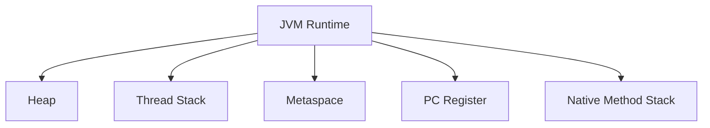
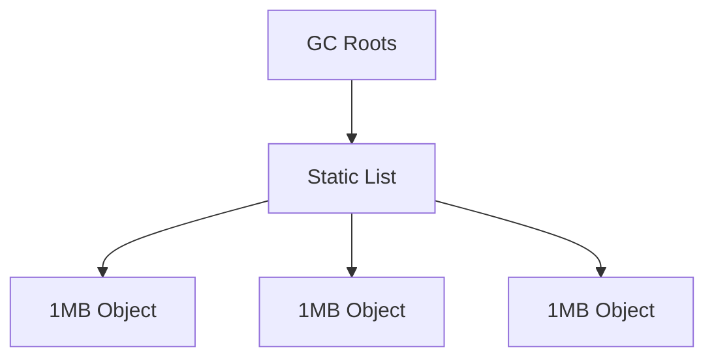
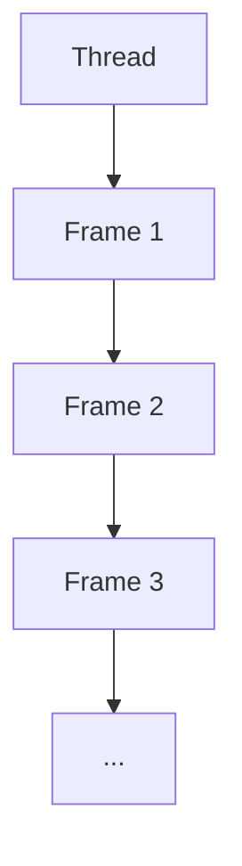
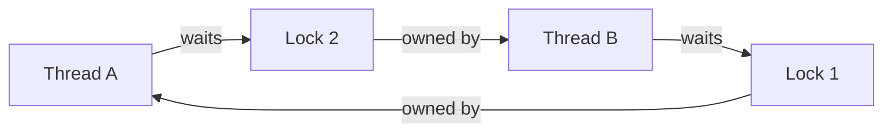

# PRINCIPLE

## JVM 内存模型

## 堆内存溢出

- 静态集合持有对象会形成强可达链
- 堆无法回收足够对象时会抛出 OOM

## 栈内存溢出

- 每次递归都会消耗新的栈帧
- `-Xss` 越小，触发栈溢出越快

## CPU 飙高

- 忙循环线程长期处于运行态
- CPU 时间片会持续分配给可运行线程

## 死锁

## 线程池耗尽

- 固定线程池大小决定并发执行上限
- 队列堆满后触发拒绝策略

## Full GC

## GC 算法对比

| 算法 | 特点 | 适用场景 |
| --- | --- | --- |
| G1 | 分区回收，兼顾吞吐与停顿 | 通用服务 |
| ZGC | 低停顿，支持大堆 | 超大内存、低延迟 |
| Parallel GC | 吞吐优先 | 批处理、离线任务 |
